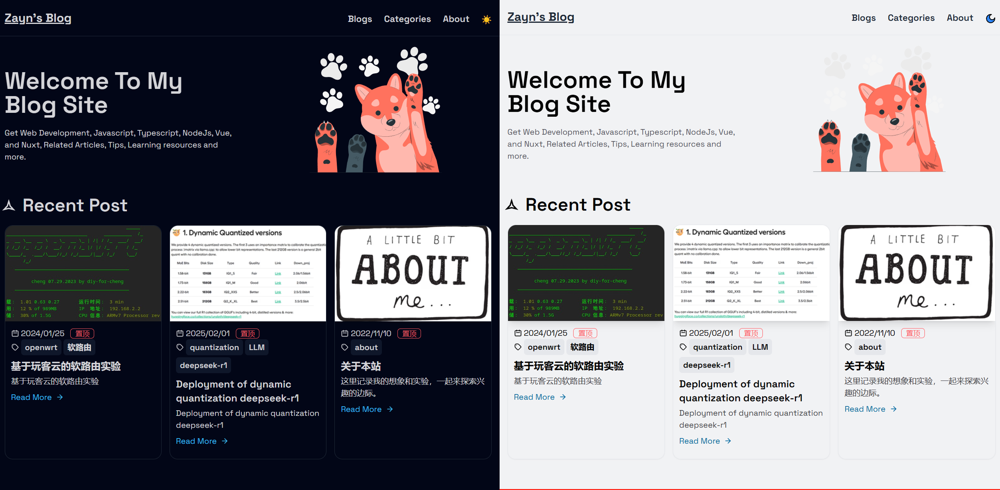

<p align="center">
  <a href="https://blog.dongsy.com.cn" target="_blank">
    
  </a>
</p>

<h1 align="center">Nuxt Blog A Personal Blog Site</h1>

### Built with

<p align="center">
    
</p>

Nuxt Blog built with [Nuxt3](https://nuxt.com), [Nuxt-Content3](https://content.nuxt.com/blog/v3), [Vue3](https://vuejs.org) & [TailwindCss](https://tailwindcss.com/) & [Daisyui](https://daisyui.com/)

> Mod from

## Features

- Write blog with markdown file
- Auto generate category from blog post
- Blog list page with search and pagination
- About me page for user info
- Auto generate table of content for blog post
- Auto generate Sitemap
- Url preview with Nuxt ogImage
- Dark and light mode
- Server Side Rendered(SSR) with Nuxt3
- RSS feed
- Pin function
- Custom Code Block

## How to Make This Blog Template Yours in 5 Minutes

- Clone this repo or use it as a template
- Go to ./data/index.ts file & add your personal info
- Then head over to the ./content/blogs folder to add new blogs
- Voilà! You've got a personalized blog site!

## Preview

> Hosted on [Vercel](https://vercel.com/): `pnpm run build`

## Build Setup

### Requires Node.js 16+

```bash
# install dependencies
pnpm install

# serve in dev mode, with hot reload at localhost:5173
pnpm run dev

# build for production
pnpm run build

# serve in production mode
pnpm run  preview

```
